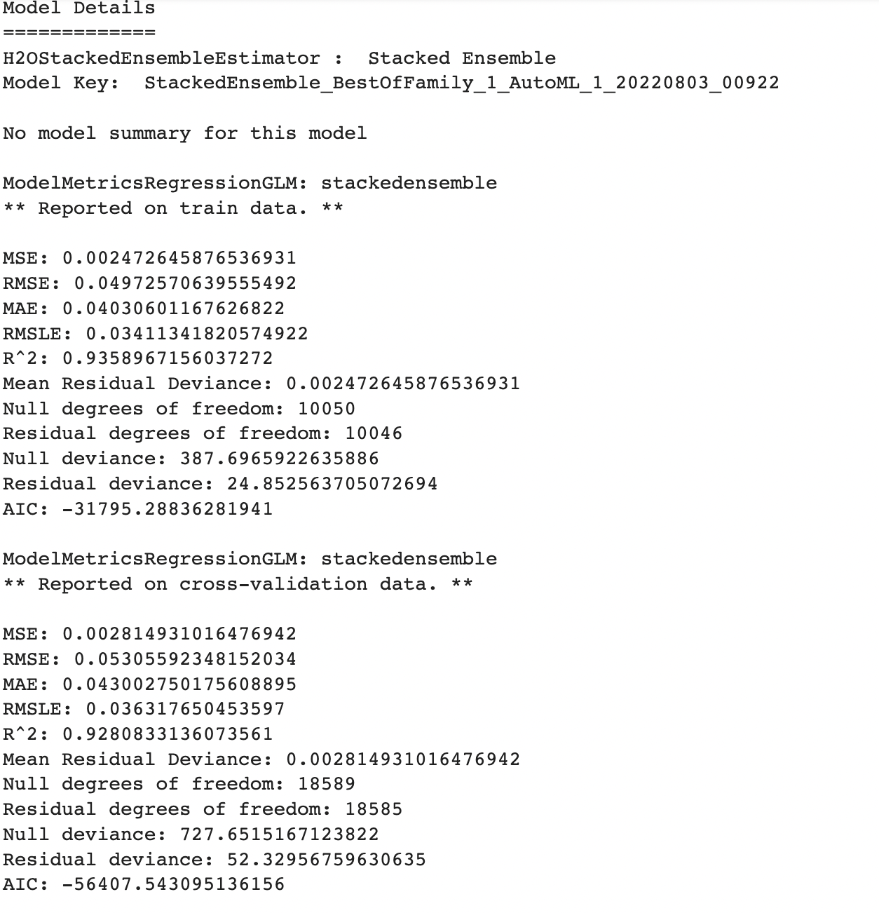

# AutoML-Burnout prediction
This project leverages the AutoML solution of [H2O.AI](https://docs.h2o.ai/h2o/latest-stable/h2o-docs/automl.html) to predict burn out rate of employees based on the provided features.

## Dataset
[Employee Burnout](https://www.kaggle.com/datasets/redwankarimsony/hackerearth-employee-burnout-challenge)

World Mental Health Day is celebrated on October 10 each year. The objective of this day is to raise an awareness about mental health issues around the world and mobilise efforts in support of mental health. According to an anonymous survey, about 450 million people live with mental disorders that can be one of the primary causes of poor health and disability worldwide.

## Getting started
1. Create a virtual environment

`python3 -m venv venv`

2. Activate the virtual environment

`source venv/bin/activate`

## Usage
To train the AutoML model, run

`python scripts/train_h2o.py`

To predict burn out rate, run

`python scripts/predict.py`

## Results

## Demo notebook
[H2O AutoML burnout prediction](https://colab.research.google.com/drive/1MjySFJmFXe8URqIp62HCl1BrPo-w_0VZ?usp=sharing)

